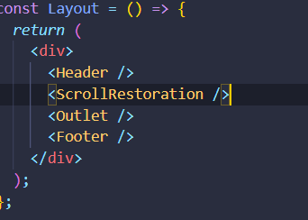

# React + Vite

This template provides a minimal setup to get React working in Vite with HMR and some ESLint rules.

Currently, two official plugins are available:

- [@vitejs/plugin-react](https://github.com/vitejs/vite-plugin-react/blob/main/packages/plugin-react/README.md) uses [Babel](https://babeljs.io/) for Fast Refresh
- [@vitejs/plugin-react-swc](https://github.com/vitejs/vite-plugin-react-swc) uses [SWC](https://swc.rs/) for Fast Refresh

# Imp Points:

- `For Sliding`: style={{ transform: `translateX(-${currentSlide * 100}vw)` }}
- `Making navigation bar sticky`: sticky top-0 z-50
- `fetch data`:
  - 
- `overflow hidden` :
  the scale will not affect other products.imp
  - 
- `cut is price`:

${product.oldPrice}

- 
- use of relative and absolute `Products.jsx` mai use kiya hai
- `see how to use id for product details`
  const \_id = product.title;
  const idString = (\_id) => {
  return String(\_id).toLowerCase().split(" ").join("");
  };
  const rootId = idString(\_id);
  console.log(rootId);
- new keyword : 
- useLocation() and useNavigation();
